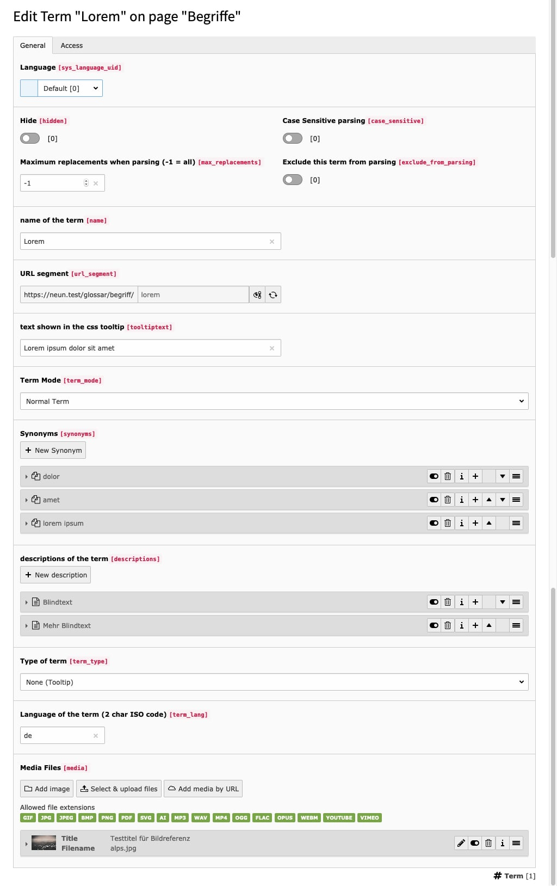
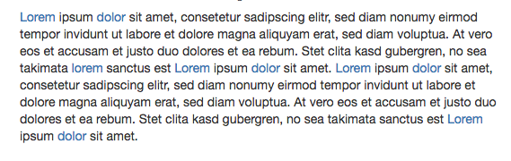

.. ==================================================
.. FOR YOUR INFORMATION
.. --------------------------------------------------
.. -*- coding: utf-8 -*- with BOM.

.. include:: ../Includes.txt

Introduction
============

What does it do?
----------------

This extension lets you integrate a simple glossar for your website.
A special functionality is the configurable parser of terms on your pages.

Advantage of dpn_glossary
-------------------------

+ Simple configuration

+ Automatic parsing of terms on pages

Screenshots
-----------

    The editing of one a term

    The automatic parser finds terms you defined and links them to your detailpage
